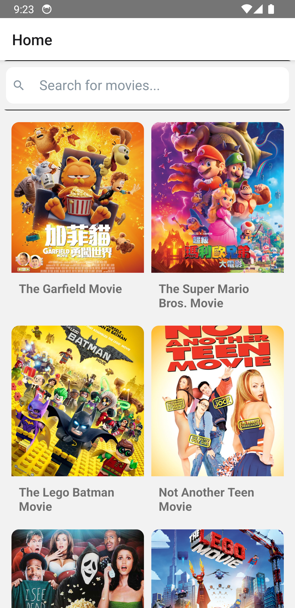
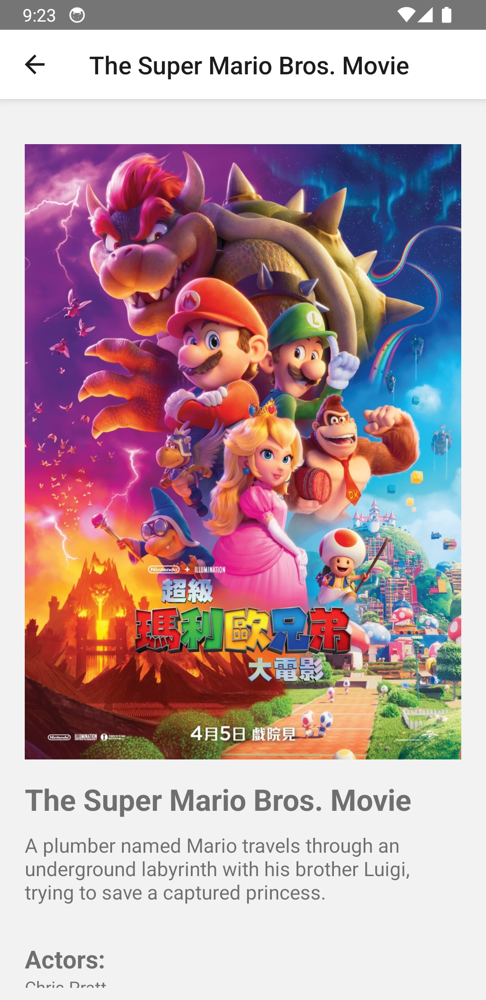
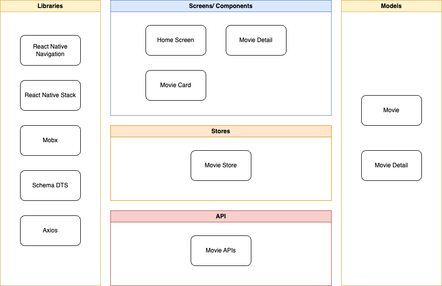

# Movie Application

## Introduction

Mini movie application to help user search movie and check the detail information.

This is a project to study and test out the React Native and Mobx architecture.

## Features

| Screen Name | Screenshot |
|:---|:---|
| Home Screen |  |
| Detail Screen |  |

## Architecture



## Development

### I. Development IDE and Environment setup
1. Install Android Studio
2. Install NDK and CMake in Android Studio 
3. Install Java 17
4. Install Node.js - This application is developed with Node.JS v20
5. Setup React Native environment - This application is developed with React Native v0.74
   
    Follow this link [React Native - Setup Environment](https://reactnative.dev/docs/environment-setup)

1. Install ```yarn``` (**Optional**)
2. Install XCode
3. Install Visual Studio Code or any JavaScript editor
   
    Follow this link to setup VS Code [VS Code React Native - Setup Environment](https://marketplace.visualstudio.com/items?itemName=msjsdiag.vscode-react-native)

### II. Run project
1. Open the project in terminal
2. Run this cmd to install dependencies
```bash
npm install
```
or
```bash
yarn install
```
3. Run this cmd to start the application on android
```bash
npx react-native run-android
```
4. Run these commands to start the application on ios
```bash
#from the root of the project, run this to install the pods
cd ios && pod install

npx react-native run-ios
```

### III. Setup Project with Movie SDK
Movie SDK is created to encapsulate the business of searching and fetch movie data.

1. Pull source code of Movie SDK from [Movie SDK](https://github.com/khanhtbh/NodePackageWithMobx.git)
2. Run this cmd to install dependencies
```bash
npm install
```
or
```bash
yarn install
```
3. Build SDK with following command
```bash
yarn build
```
4. Checkout the source code of project Movie Application at this branch ```features/with-sdk```
5. Install the SDK with following command for Movie Application
```bash
yarn add n-movie-sdk@file:[./path/to/sdk-folder]
``` 
6. Stop the Metro server if it's running and run the app with the instruction above

## License
MIT